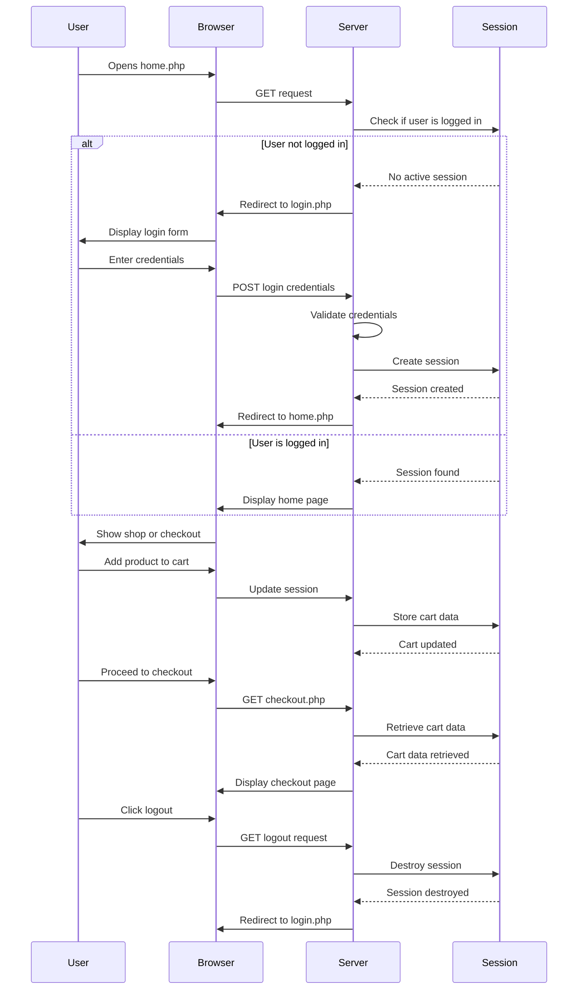

## About Shop application
> Using this small program to explain about the Sessions.

> To run the program, please read the follow:
#### Requirements
* PHP

#### Features
1. Login
2. Add product
3. Checkout
4. Logout

#### Installation
```
git clone https://github.com/Stucom-Pelai/MP0487_RA4_Session_Shop
```

#### Run 
```
run file home.php
```

#### Sequence Diagram


   
